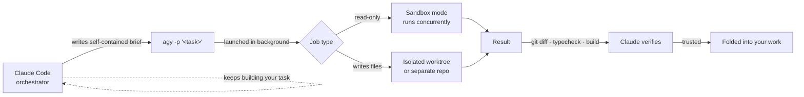

<div align="center">

# Claude Code Antigravity Agents

*Turn Claude Code into an orchestrator — delegate heavy jobs to Google Antigravity sub-agents while it keeps building.*

[](https://claude.com/claude-code)
[](https://antigravity.google/docs/cli/getting-started)
[](#how-it-works)
[](#install-the-skill)
[](#prerequisites)
[](#license)

**Created by [Mark Fulton](https://markfulton.com)** · Founder of the **[Vibe Coding is Life](https://facebook.com/groups/vibecodinglife)** community (300k+ members) 

Co-authored by Claude Fable 5

</div>

---

A single Claude Code **skill** — one markdown instruction file (`SKILL.md`) named `antigravity-agents`. Skills are capabilities [Claude Code](https://claude.com/claude-code) loads on demand. This one teaches it to hand off work to the [Google Antigravity CLI](https://antigravity.google/docs/cli/getting-started) (`agy`), an autonomous terminal coding agent powered by Gemini and other models.

With the skill loaded, Claude Code stops being a single worker and becomes an **orchestrator**: it writes a self-contained brief, launches an `agy` job in the background, keeps working on your task, then collects and **verifies** the result before trusting a line of it.

## Contents

- [Why you'd want this](#why-youd-want-this)
- [How it works](#how-it-works)
- [Prerequisites](#prerequisites)
- [Install the skill](#install-the-skill)
- [Usage](#usage)
- [Safety model](#safety-model)
- [Attribution](#attribution)

## Why you'd want this

- **Save your tokens.** Full-repo audits, big refactors, and research sweeps are expensive to run inside a Claude session. Offload them to Antigravity instead of burning your Claude context and subscription tokens on the grind work.
- **Broaden your model choice.** Run a job on Gemini (or whatever Antigravity offers) for a genuinely independent second opinion — or just to put the right model on the right task.
- **Work in parallel.** Fan out several sub-agent jobs at once while Claude Code stays responsive to you. More gets done per unit of wall-clock time.

|  | Solo Claude Code session | With `antigravity-agents` |
| --- | --- | --- |
| Long audits / refactors | Run inline, spending your context | Handed off to a background sub-agent |
| Second opinion | Same model, same session | An independent model reviews the work |
| Throughput | One task at a time | Multiple jobs run while Claude stays responsive |
| Your Claude tokens | Spent on the heavy lifting | Spent on orchestration and verification |

## How it works

Claude writes the brief, launches the job non-interactively (`agy -p "<task>"`), and immediately returns to your work. The sub-agent runs on its own. When it finishes, Claude reads the output and **verifies it** — `git diff`, typecheck, build — before any of it is trusted or merged.



## Prerequisites

Two one-time steps.

**1. Install the Antigravity CLI.**

On macOS / Linux:

```bash
curl -fsSL https://antigravity.google/cli/install.sh | bash
```

On Windows (PowerShell):

```powershell
irm https://antigravity.google/cli/install.ps1 | iex
```

Full details are in the official guide: **https://antigravity.google/docs/cli/getting-started**

**2. Sign in to Google.**

Run `agy` once in a terminal and complete the one-time Google OAuth sign-in in your browser:

```bash
agy
```

After that, Claude Code can launch `agy` jobs non-interactively — no further prompts.

## Install the skill

Clone this repo and copy the `antigravity-agents` folder into your Claude Code skills directory. Claude Code auto-discovers it on the next run.

**macOS / Linux**

```bash
git clone https://github.com/markfulton/claude-antigravity-agents.git
cp -r claude-antigravity-agents/antigravity-agents ~/.claude/skills/
```

**Windows (PowerShell)**

```powershell
git clone https://github.com/markfulton/claude-antigravity-agents.git
Copy-Item -Recurse claude-antigravity-agents\antigravity-agents "$env:USERPROFILE\.claude\skills\"
```

That's it. Start a Claude Code session and ask it to delegate something — the skill loads on demand.

## Usage

Just talk to Claude Code the way you already do. A few prompts that trigger the skill:

> "Have Antigravity review my current branch diff for bugs while you keep building the checkout flow."

> "Spin up a sub-agent to audit this repo's dependencies for known vulnerabilities and report back."

> "Get a second opinion from Gemini on this caching design, and keep working on the API in the meantime."

Claude decides the job type, picks the right isolation mode, launches it in the background, and reports back once it has collected and verified the result.

## Safety model

Delegation only helps if you can trust what comes back. One rule sits above everything else:

> **An Antigravity job never writes to the same files Claude Code is editing at that moment.**

That rule drives how every job runs:

| Job type | Writes files? | Isolation | Concurrent with Claude? |
| --- | --- | --- | --- |
| Code review | No | Sandbox (read-only) | Yes |
| Architecture / security analysis | No | Sandbox (read-only) | Yes |
| Research sweep | No | Sandbox (read-only) | Yes |
| Dependency / config audit | No | Sandbox (read-only) | Yes |
| Second opinion (different model) | No | Sandbox (read-only) | Yes |
| Coding task | Yes | Isolated git worktree | Yes — on separate files |
| Large refactor | Yes | Worktree / separate repo | Yes — on separate files |

**Everything is verified before it's trusted** — Claude inspects the `git diff` and runs the project's typecheck / build on any returned work before folding it in. No sub-agent change is taken on faith. Keep a task in Claude when it's small, tightly coupled to what you're editing right now, or needs live back-and-forth; delegation shines on the heavy, separable work.

## Attribution

- **Created by [Mark Fulton](https://markfulton.com)**
- Founder of the **[Vibe Coding is Life](https://facebook.com/groups/vibecodinglife)** community (300k+ members)
- Co-authored by **Claude Fable 5**

## License

Released under the [MIT License](LICENSE).
